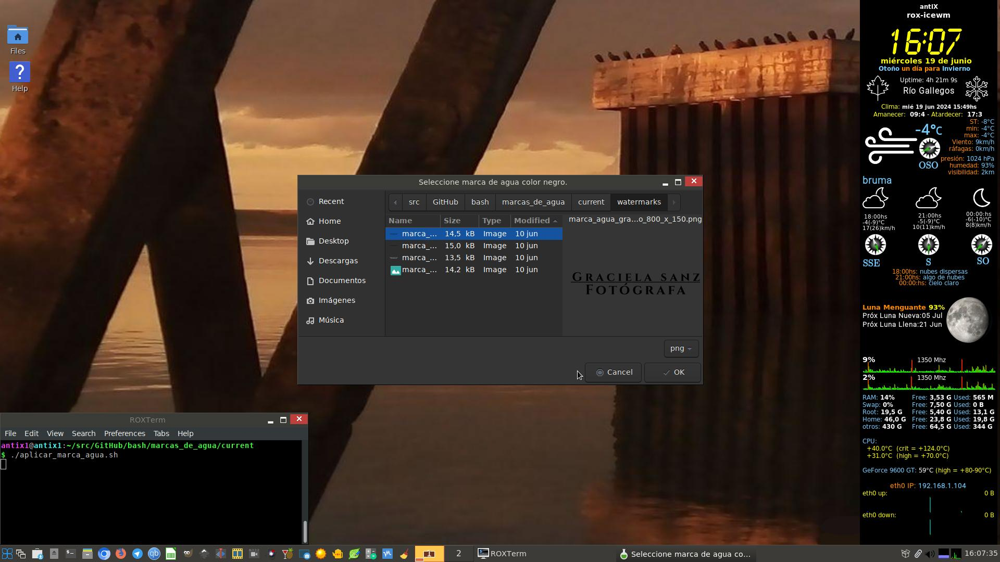
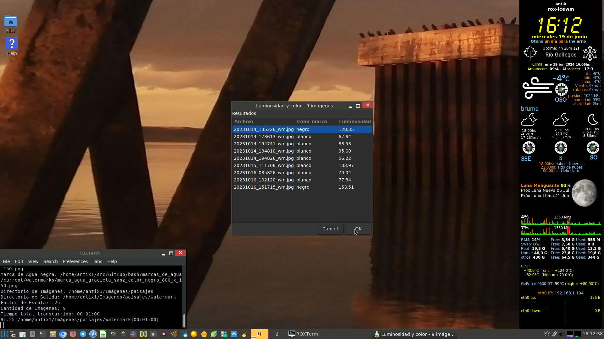

In today's digital world, protecting your images is more important than ever. With the rise of online content, it's crucial to ensure your work is protected from unauthorized use. An effective way to do this is by applying watermarks to your images.

But what happens when you have hundreds, or even thousands of images that need to be protected? That's where automation comes into play.

With the following bash script, we simplify the process of applying large-scale watermarks. Let's see how it works.

The script loops through each image in the specified directory, obtaining its size and automatically calculating the proportional size of the watermark.

It then resizes the watermark to perfectly fit each image, removing any embedded color profiles to ensure a clean, consistent application.

Finally, apply the watermark to the bottom of each image, with a centered bottom margin for an elegant and professional presentation.

With this automated process, you can protect your images efficiently and reliably, keeping your work safe and secure at all times.


* * *
# **Update in 10/06/24**
### Bash Script: `aplicar_marca_agua.sh`

#### Usage:

```bash
aplicar_marca_agua.sh -b [white_watermark] -n [black_watermark] -d [image_directory] -s [scale_factor] -o [output_directory]
```

#### Description:

This script automates the process of applying a watermark to all images in a specified directory. Here's a step-by-step breakdown of what the script does:

1. Verification of ImageMagick commands:
   - Checks if the commands 'identify', 'convert', and 'composite' are available.

2. Definition of parameters:
   - `MARCA_DE_AGUA_BLANCA`: Path to the image used as the white watermark.
   - `MARCA_DE_AGUA_NEGRA`: Path to the image used as the black watermark.
   - `DIRECTORIO_IMAGENES`: Directory containing the images to which the watermark will be applied.
   - `FACTOR_ESCALA`: Scale factor determining the proportional size of the watermark relative to the original image width.
   - `DIRECTORIO_SALIDA`: Directory where the images with the applied watermark will be saved.

3. Verification of parameters and paths:
   - Ensures all necessary parameters are provided.
   - Verifies that watermark paths and the image directory exist.
   - Creates the output directory if it doesn't exist.

4. Loop to process each image:
   - Iterates over each file in the specified image directory.
   - Checks if the current file in the loop is a regular file using the condition `if [ -f "$IMAGE" ]`.

5. Obtaining the image size:
   - Uses the `identify` command to get the size of the image in pixels.

6. Calculation of watermark size:
   - Calculates the size of the watermark proportional to the original image size using the defined scale factor.

7. Resizing the watermark:
   - Resizes the watermark to the calculated size and removes any embedded color profile to avoid warnings.

8. Applying the watermark:
   - Applies the watermark to the bottom of the image with a centered bottom margin using the `composite` command.

9. Removal of temporary files:
   - Deletes the temporary file of the resized watermark after applying it to the image.

### Python Script: `clasificar_imagen_v5.py`

#### Usage:

```bash
clasificar_imagen_v5.py <image_path> <scale_factor>
```

#### Description:

This script loads an image and defines the bottom region of the image. It performs color-based segmentation in the bottom region and calculates the average luminosity of the bottom region.
imagemagick
#### Dependencies:
- **Imagemagick**: software suite for manipulating and editing images.
  - Install using: `sudo apt-get install imagemagick`
- **bc**: is a Unix-like arbitrary precision calculator.
  - Install using: `sudo apt-get install bc`
- **OpenCV (`cv2`)**: A popular open-source library designed for computer vision and image processing.
  - Install using: `sudo apt-get install python3-opencv`
- **NumPy**: Fundamental library in Python for scientific and numerical computing. It is used to calculate statistics such as mean and standard deviation of luminosity for color detection in the bottom region of the image.
  - Install using: `sudo apt-get install python3-numpy`

* * *
# **Update in 14/06/2024**

"Watermark" reaches v1.0 status. 
https://github.com/DrCalambre/watermark/releases/tag/v1.0

* * *
# **Update in 19/06/2024**

Uses **YAD (Yet Another Dialog)**

### Features

1. **ImageMagick Command Verification**: Ensures that `identify`, `convert`, and `composite` commands from ImageMagick are available.
2. **Script and Image Paths**: Determines the script's directory and sets paths for a required Python script and a default image.
3. **File Existence Checks**: Verifies the existence of necessary files before proceeding.
4. **User Input Prompts**: Uses **YAD (Yet Another Dialog)** dialogs to prompt the user to select watermark images, input and output directories, and a scaling factor.
5. **Image Processing**: Processes each image, determines the appropriate watermark color using a Python script, resizes the watermark, and applies it to the image.
6. **Progress and Summary**: Displays a progress bar and a summary of the process using **YAD**.

### ====Usage:====

```bash
aplicar_marca_agua.sh
```
1. **Install Dependencies**:
   Ensure `ImageMagick` and `yad` are installed on your system.
  - Install using: 

```bash
   sudo apt-get install imagemagick yad
```
2.- **bc**: is a Unix-like arbitrary precision calculator.

```bash
  sudo apt-get install bc
```
3.- **OpenCV (`cv2`)**: A popular open-source library designed for computer vision and image processing.
  - Install using: 
```bash
  sudo apt-get install python3-opencv
```
4.- **NumPy**: Fundamental library in Python for scientific and numerical computing. It is used to calculate statistics such as mean and standard deviation of luminosity for color detection in the bottom region of the image.
  - Install using: 
```bash
  sudo apt-get install python3-numpy
```
  
### screenshot YAD:





_ _ _
###### screen to enter the scaling factor that determines the size of the watermark to apply
_ _ _

# **screen with the summary of chosen options**





---

These scripts provide a convenient solution for batch watermarking images with customizable options for watermark color and size.

- - -

More info: https://drcalambre.blogspot.com/2024/06/automatizacion-de-marcas-de-agua-en.html

Although my blog is in Spanish, there is a language translator for a better understanding. 

Best regards 
;)

* * *
#### Some examples of images after being stamped with watermarks:


